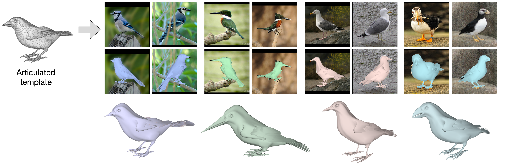

# Aves
Code repository for the paper: \
**Birds of a Feather: Capturing Avian Shape Models from Images**  
[Yufu Wang](https://yufu-wang.github.io), [Nikos Kolotouros](https://www.seas.upenn.edu/~nkolot/), [Kostas Daniilidis](https://www.cis.upenn.edu/~kostas/), [Marc Badger](https://www.ocf.berkeley.edu/~badger/)\
CVPR 2021 \
[[Project Page](https://yufu-wang.github.io/aves/)]



## Bird Species Capturing
We provide the captured [3D meshes](bird_meshes) of the 17 bird species in the paper, which you can view with [MeshLab](https://www.meshlab.net). We only provide the average shape for each species, but you can also build species-specific morphable model by repeating the experiments using this repo and the demo.


## Installation instructions
```
python3 -m venv aves
source aves/bin/activate
pip install -U pip
pip install -r requirements.txt
```
In addition, please install pytorch3D (0.2.5) with CUDA support
```
pip install 'git+https://github.com/facebookresearch/pytorch3d.git@v0.2.5'
```

If you need offscreen rendering (e.g. over SSH), please look at these [instructions](https://pyrender.readthedocs.io/en/latest/install/index.html) for installing pyrender with OSMesa. 

## Prepare data
We use a subset of the CUB dataset to learn our models. Please download the the [CUB dataset](http://www.vision.caltech.edu/visipedia/CUB-200-2011.html) and place it under `aves`. Run the following to format the data.
```
python scripts/prepare_data.py
```
We combine CUB annotations with our own annotated keypoints. You can find what keypoints are used in `keypoints_list.txt`. We have provided the combined annotations in `data/CUB`. If you use any of them, please cite the original dataset.


## Run demo and evaluation
We provide demo codes to run the main reconstruction method presented in the paper. We will slowly release more code to produce the other results in the paper, including single-view model regression, and UMAP analysis.

Demo for main method. We provide a sinlge set of hyperparameters that works well with all the species in the paper, but you can get better results by tweaking these hyperparameters for each species seperately.
```
python scripts/fitting.py
```

Demo for fitting the AVES model to images
```
python scripts/fit_aves.py
```
or fit AVES to all annotated images and evaluate fitting quality
```
python scripts/eval_aves.py
```


## Citing
If you find this model and code useful for your research, or use data generated by our model, please consider citing the following paper:

	@Inproceedings{wang21aves,
	  Title          = {Birds of a Feather: Capturing Avian Shape Models from Images},
	  Author         = {Yufu Wang and Nikos Kolotouros and Kostas Daniilidis and Marc Badger},
	  Booktitle      = {Computer Vision and Pattern Recognition (CVPR)},
	  Year           = {2021}
	}


